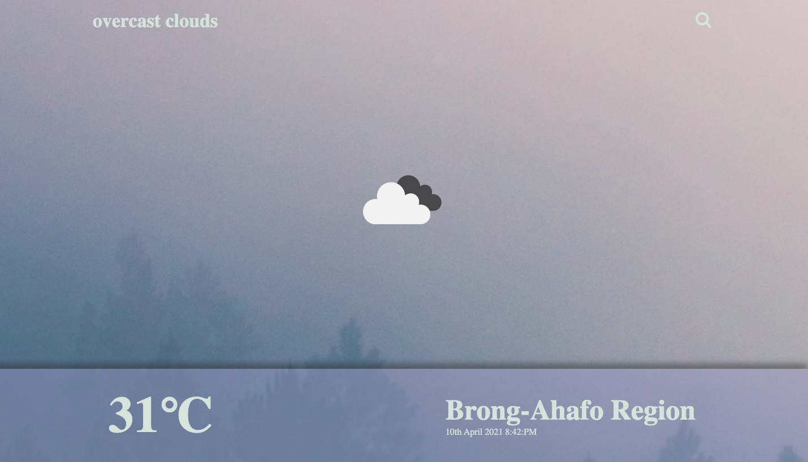

# weather-app search and display current weather. 

## Built with

- HTML/CSS
- JAVASCRIPT
- WEBPACK

## Live Demo

- [Live](https://juxsalley.github.io/weather-app/)

# Getting Started

### clone repository into your computer by running in terminal

- ``git clone https://github.com/juxsalley/weather-app.git``

- ``cd weather-app``

- `` npm run build ``

# Author 
**Salley Iddrisu 👨‍💻**
- [Jux salley](https://github.com/juxsalley)
- [__salley](https://twitter.com/__salley)
- [Iddrisu salley](https://www.linkedin.com/in/dev-salley/)

## 🤝 Contributing

Contributions, issues and feature requests are welcome!

Feel free to check the [issues page](https://github.com/juxsalley/weather-app/issues).

## Show your support
Give a ⭐️ if you like this project!# restaurant-landing-page